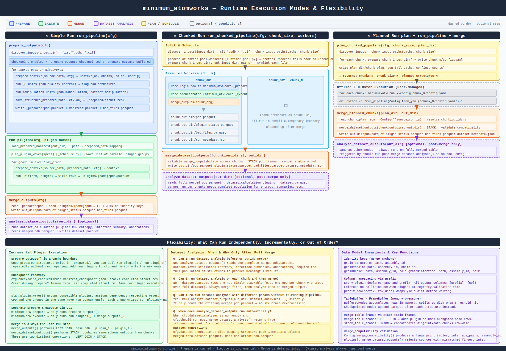
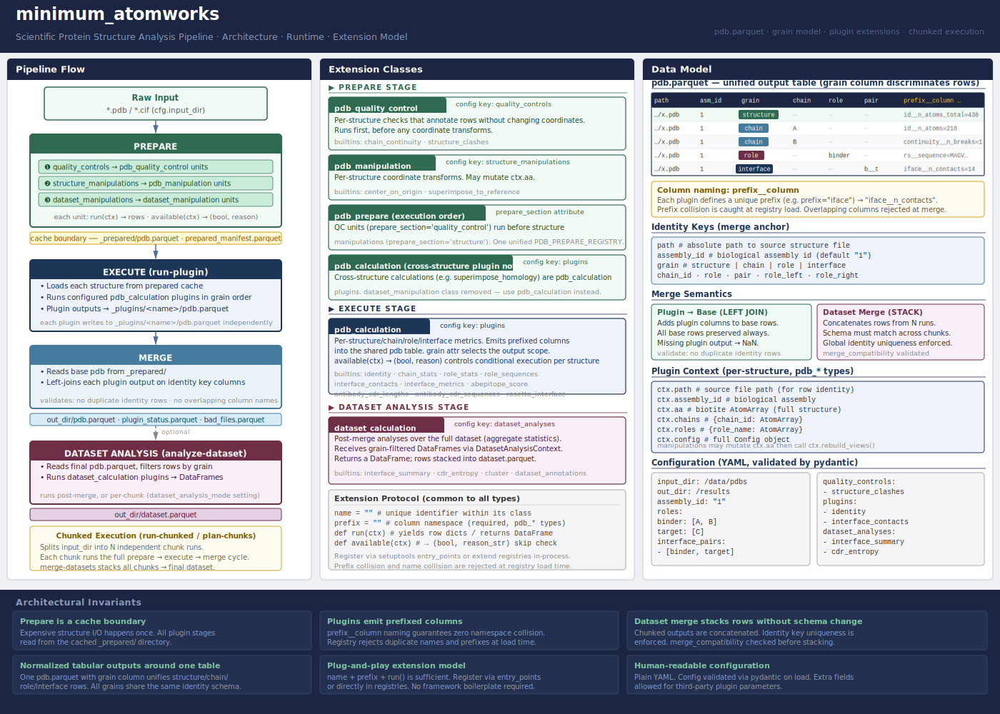
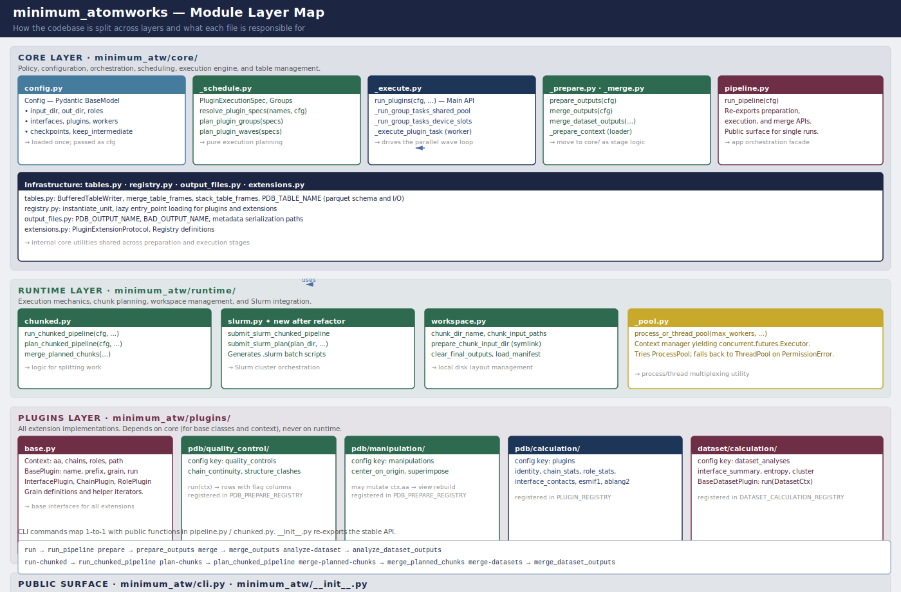
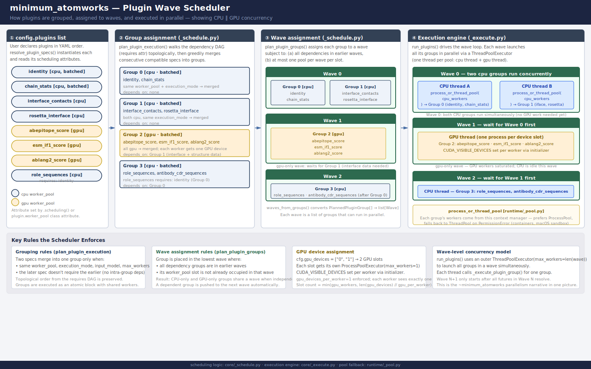

# minimum_atomworks

`minimum_atomworks` is a structural data-processing package for protein complexes.

It produces one unified PDB-side table plus optional dataset-level analysis output:

- `pdb.parquet`
- `dataset.parquet`

It is designed for:

- antibody-antigen complexes
- VHH or nanobody binders
- generic protein-protein complexes

The package is built around a simple idea:

1. prepare structures once
2. run PDB calculation plugins that add prefixed columns
3. merge into the final PDB parquet
4. optionally run dataset-level analyses

## Common Use Cases

You would typically use `minimum_atomworks` in one of these situations:

- You have one antibody-antigen design set and want a ranked structural table with QC, interface metrics, and optional model scores.
- You have a VHH / nanobody binder campaign and need the same interface analysis with single-chain antibody numbering.
- You have generic protein-protein complexes and want non-antibody interface metrics without the antibody-specific stack.
- You want to run Rosetta preprocessing or Rosetta InterfaceAnalyzer alongside the native metrics.
- You have a large dataset that no longer fits comfortably in one local run and need chunking or Slurm submission.
- You have multiple completed datasets and want to merge them for pooled clustering or cross-dataset comparison.

If you just want to start from the right YAML, use this map:

| Situation | Start from |
|---|---|
| Minimal antibody-antigen QC / ranking on one dataset | `minimum_atw/examples/input/simple_run/example_antibody_antigen_light.yaml` |
| Full antibody-antigen analysis without Rosetta | `minimum_atw/examples/input/simple_run/example_antibody_antigen_pdb.yaml` |
| Full antibody-antigen analysis with Rosetta preprocess + InterfaceAnalyzer | `minimum_atw/examples/input/simple_run/example_antibody_antigen_rosetta.yaml` |
| Ready local smoke run on bundled example structures | `minimum_atw/examples/input/simple_run/example_antibody_antigen_realdata_all_non_rosetta.yaml` |
| VHH / nanobody against antigen | `minimum_atw/examples/input/simple_run/example_vhh_antigen.yaml` |
| Generic protein-protein complexes | `minimum_atw/examples/input/simple_run/example_protein_protein_complex.yaml` |
| Large antibody-antigen dataset on one node or Slurm | `minimum_atw/examples/input/large_run/example_antibody_antigen_chunked.yaml` |
| Large VHH-antigen dataset on one node or Slurm | `minimum_atw/examples/input/large_run/example_vhh_antigen_chunked.yaml` |
| Large protein-protein dataset on one node or Slurm | `minimum_atw/examples/input/large_run/example_protein_protein_chunked.yaml` |
| Merge and compare two completed datasets | `minimum_atw/examples/input/multi_dataset/dataset_a_antibody_antigen.yaml`, `minimum_atw/examples/input/multi_dataset/dataset_b_antibody_antigen.yaml`, then `minimum_atw/examples/input/multi_dataset/compare_merged_datasets.yaml` |

## Runtime Overview

Main pipeline:

- `prepare`
  load structures, run PDB and dataset prepare units, cache prepared structures when requested
- `pdb calculations`
  emit prefixed columns into unified PDB rows
- `merge`
  build final `pdb` output plus runtime metadata
- `dataset analyses`
  read merged `pdb` output and write `dataset` output

Large-dataset paths:

- `run-chunked`
  one larger job, internal chunk parallelism via `--workers`
- `plan-chunks` + `merge-planned-chunks`
  generate scheduler-ready chunk configs, run them externally, then merge
- `merge-datasets`
  stack already completed datasets, as long as they are compatible

Plugin execution planning can also separate CPU and GPU plugins into distinct worker pools.
Independent groups may run in different execution waves so CPU and GPU resources can be used at the same time.



---

## Run Shapes From Start to Finish

Every YAML goes through the same high-level lifecycle:

1. validate the YAML into `Config`
2. discover structures from `input_dir`
3. run the prepare stage and write `_prepared/`
4. run PDB plugins, using CPU and GPU pools when configured
5. merge plugin outputs into `out_dir/pdb.parquet`
6. optionally run dataset analyses and write `out_dir/dataset.parquet`

What changes between local and HPC runs is not the science logic. What changes is:

- whether everything happens in one process or in chunks
- whether chunk execution is local or submitted to Slurm
- whether CPU and GPU work happen inside one job or in separate staged jobs
- whether intermediate `_prepared/` and `_plugins/` artifacts are kept for reuse

You normally do **not** need separate CPU and GPU YAML files. One YAML can describe the full analysis. The package decides which built-in plugins belong in the CPU pool or GPU pool, and you only choose how much hardware to expose to the run.

### Choose a Run Shape

| Run shape | Command | How to enable it | What happens from start to end | Best for |
|---|---|---|---|---|
| One-shot local run | `python -m minimum_atw.cli run --config my.yaml` | No extra config required | One process runs prepare → execute → merge → dataset analysis | Small or medium runs on one workstation |
| Staged local run | `prepare`, then `run-plugin` or `run-plugins`, then `merge`, then `analyze-dataset` | Set `keep_intermediate_outputs: true` if you want to reuse `_plugins/` | Prepare is done once, then you can rerun selected plugins or analyses without repeating the whole pipeline | Debugging, plugin tuning, rerunning clustering |
| Local chunked run | `python -m minimum_atw.cli run-chunked --config my.yaml --chunk-size 50 --workers 4` | Choose `--chunk-size`; set `cpu_workers`, `gpu_workers`, `gpu_devices` in YAML if needed | Inputs are split into chunks; each chunk runs a full mini-pipeline locally; then all chunk outputs are stacked and analyzed once | One big workstation or one HPC node without a scheduler workflow |
| Planned chunks, manual submission | `plan-chunks`, external chunk execution, then `merge-planned-chunks` | Choose `--chunk-size` and `--plan-dir` | The package writes one YAML per chunk plus a resource plan; you submit chunks yourself; final merge happens after all chunk runs finish | Custom schedulers, full control, persistent `_prepared/` paths |
| One-command Slurm submission | `python -m minimum_atw.cli submit-slurm --config my.yaml` | Add a `slurm:` block to the YAML | The package plans chunks, chooses mixed vs staged CPU/GPU submission, submits the job graph, then runs the final merge job | Normal HPC usage where you want one command and automatic scheduling |

### Main Options and When to Turn Them On

| Option | Where to set it | What it changes | Turn it on when |
|---|---|---|---|
| `cpu_workers` | YAML | CPU plugin concurrency per run or per chunk | CPU plugins dominate runtime and you have spare cores |
| `gpu_workers` | YAML | Number of GPU worker slots | You want built-in GPU plugins to use CUDA workers instead of CPU fallback |
| `gpu_devices` | YAML | Which CUDA devices the run may use | Your machine or node has multiple GPUs and you want to pin the run |
| `keep_intermediate_outputs` | YAML | Preserves `_prepared/` and `_plugins/` outputs | You want to rerun plugins or analyses without starting from scratch |
| `checkpoint_enabled` and `checkpoint_interval` | YAML | Periodic progress flush during plugin execution | Runs are long or may be preempted |
| `dataset_analysis_mode` | YAML | Whether dataset analyses run per chunk, post-merge, or both | Use `post_merge` for clustering and entropy; use `per_chunk` only for early feedback |
| `slurm.chunk_size` | `slurm:` block in YAML | Size of each submitted chunk | A dataset is too large for one job and should be distributed |
| `slurm.mode` | `slurm:` block in YAML | `auto`, `mixed`, or `staged` submission policy | Use `auto` by default; force `staged` when GPU nodes are scarce; force `mixed` when one job per chunk is simpler |
| `slurm.sbatch_*_args` | `slurm:` block in YAML | Cluster-specific account, partition, memory, walltime, and GPU requests | You are submitting on Slurm and need scheduler policy attached to the run |

### What Local vs HPC Actually Means

#### Local

- `run` is the simplest path: one command, one output directory, one end-to-end pipeline.
- `run-chunked` is still local, but the package internally splits the input and runs multiple chunk pipelines at once.
- CPU and GPU plugin pools can both be active on the same machine when `gpu_workers > 0`.

#### HPC

- `plan-chunks` is the manual HPC path: the package tells you what to run, but you submit the jobs yourself.
- `submit-slurm` is the automatic HPC path: the package creates the plan and submits the dependent Slurm jobs for you.
- In `slurm.mode: mixed`, each chunk job gets both CPU and GPU resources and runs the full chunk pipeline.
- In `slurm.mode: staged`, CPU-node jobs prepare structures and run CPU plugins first, then GPU-node jobs load `_prepared/` and run only GPU plugins, then a final CPU merge job writes the merged outputs.

### Default Recommendation

Use this rule of thumb:

- local workstation, small or medium dataset: `run`
- local workstation, dataset too large for one process: `run-chunked`
- HPC cluster, standard use: `submit-slurm` with `slurm.mode: auto`
- HPC cluster, custom scheduler or special job policy: `plan-chunks` + manual submission
- plugin debugging or iterative tuning: staged local commands with `keep_intermediate_outputs: true`

The detailed stage-by-stage explanation starts below, and the CPU/GPU scheduling details are covered again later in [CPU vs GPU Execution — What Happens Behind the Scenes](#cpu-vs-gpu-execution--what-happens-behind-the-scenes).

---

## Running a YAML — Full Walkthrough

This section follows one run from the moment you type the command to the moment the parquet files land in `out_dir`. It covers every configurable decision point, what each option does, and which case it is best suited for.

---

### Step 0 — Pick and configure a YAML

Every run starts from a YAML config. Pick the closest template from `examples/`:

| Template | Best for |
|---|---|
| `examples/input/simple_run/example_antibody_antigen_light.yaml` | Quick start, no reference structure, CPU only |
| `examples/input/simple_run/example_antibody_antigen_pdb.yaml` | Full antibody-antigen, superimpose, GPU plugins |
| `examples/input/simple_run/example_antibody_antigen_rosetta.yaml` | Antibody-antigen with Rosetta preprocess and InterfaceAnalyzer |
| `examples/input/simple_run/example_antibody_antigen_realdata_all_non_rosetta.yaml` | Ready local run using the bundled antibody-antigen example structures |
| `examples/input/simple_run/example_vhh_antigen.yaml` | VHH / nanobody binders |
| `examples/input/simple_run/example_protein_protein_complex.yaml` | Generic protein-protein, no CDR analysis |
| `examples/input/large_run/example_antibody_antigen_chunked.yaml` | Large dataset, Slurm submission |

For the full example catalog, including manual chunking and multi-dataset
comparison, see `minimum_atw/examples/README.md`.

At minimum, set two paths in the YAML:

```yaml
input_dir: "/path/to/your/pdb_or_cif_files"
out_dir:   "/path/to/your/output_directory"
```

Then set roles and interface pairs to match your chain layout:

```yaml
roles:
  antigen:  ["A"]
  vh:       ["C"]
  vl:       ["B"]
  antibody: ["B", "C"]

interface_pairs:
  - ["antibody", "antigen"]
```

---

### Step 1 — Prepare stage

The prepare stage runs once per input structure, in the order listed in `manipulations`. Each manipulation mutates the in-memory structure (`ctx.aa`) so the next manipulation sees the already-modified coordinates. The final transformed structure is cached to `_prepared/structures/` for all subsequent plugin runs.

#### Quality control manipulations (always run first)

| Manipulation | What it does | Enable when |
|---|---|---|
| `chain_continuity` | Flags residue-index gaps and backbone breaks per chain; writes `continuity__*` columns | Almost always — catches broken models early |
| `structure_clashes` | Counts atom pairs closer than `clash_distance` (default 2 Å); writes `clash__*` columns | Almost always — catches steric errors |

Config options for QC:

```yaml
clash_distance: 2.0          # Å threshold; lower = stricter
clash_scope: "all"           # all | inter_chain | interface_only
```

#### Structure manipulations (run after QC, in listed order)

| Manipulation | What it does | Enable when |
|---|---|---|
| `center_on_origin` | Translates the whole complex so its centroid is at (0,0,0); writes `center__centroid_x/y/z` | Useful before superimposition or as a simple normalisation step |
| `superimpose_to_reference` | Aligns every structure's coordinates onto a reference PDB using `superimpose_homologs`; writes `sup__shared_atoms_rmsd`, per-chain `sup__rmsd`; **replaces coordinates in `_prepared/`** | When you have a crystal reference and want all models in the same structural frame |
| `rosetta_preprocess` | Runs Rosetta score → repack/relax → score again → then (by default) superimposes the relaxed structure to the reference; writes `rosprep__pre_*` (pre-relax scores), `rosprep__post_*` (post-relax scores), and superimpose metrics when superimpose is on; set `rosetta_preprocess: false` to skip Rosetta and use as a plain superimpose; set `plugin_params.rosetta_preprocess.superimpose: false` to run only Rosetta relax/repack without superimposing | When you need Rosetta-relaxed structures before any analysis |

Key rules:
- `superimpose_to_reference` and `rosetta_preprocess` can be combined, but only **one** should superimpose. Two patterns:
  - **Superimpose → Rosetta relax**: list `superimpose_to_reference` first, then `rosetta_preprocess` with `superimpose: false`. Relaxes structures that are already in the reference frame.
  - **Rosetta relax → superimpose**: list `rosetta_preprocess` first with `superimpose: false`, then `superimpose_to_reference`. Aligns the relaxed coordinates to the reference.
- Never list both without `plugin_params.rosetta_preprocess.superimpose: false` — that would superimpose twice.
- Either superimpose manipulation sets `keep_prepared_structures: true` automatically so the transformed `_prepared/structures/` files persist.
- If no `reference_path` is given, the first structure in the run becomes the reference automatically (only applies when superimposing).

Config for superimpose manipulations:

```yaml
manipulations:
  - name: "chain_continuity"
    grain: "pdb"
  - name: "structure_clashes"
    grain: "pdb"
  - name: "center_on_origin"
    grain: "pdb"
  - name: "superimpose_to_reference"   # or rosetta_preprocess
    grain: "pdb"

plugin_params:
  superimpose_to_reference:
    reference_path: "/path/to/reference.pdb"
    on_chains: ["A", "B", "C"]   # anchor chains for alignment
    # anchor_atoms: "CA"          # CA | backbone (default: CA)

  # rosetta_preprocess:
  #   reference_path: "/path/to/reference.pdb"
  #   on_chains: ["A", "B", "C"]
  #   repack: true      # sidechain-only fast optimisation (backbone fixed)
  #   relax: false      # full fast-relax including backbone (expensive)
  #   superimpose: true # set false to relax only, then superimpose separately
```

Rosetta relax/repack then superimpose as separate steps:

```yaml
manipulations:
  - name: "rosetta_preprocess"
    grain: "pdb"
  - name: "superimpose_to_reference"
    grain: "pdb"

plugin_params:
  rosetta_preprocess:
    repack: true
    relax: false
    superimpose: false   # skip built-in superimpose; superimpose_to_reference runs next

  superimpose_to_reference:
    reference_path: "/path/to/reference.pdb"
    on_chains: ["A", "B", "C"]
```

Config for `rosetta_preprocess`:

```yaml
rosetta_preprocess: true   # false → skip Rosetta steps, behave like superimpose_to_reference
rosetta_score_jd2_executable: "/path/to/score_jd2.static.linuxgccrelease"  # auto-discovered if omitted
rosetta_relax_executable:    "/path/to/relax.static.linuxgccrelease"        # auto-discovered if omitted
rosetta_database:            "/path/to/rosetta/database"                    # auto-discovered if omitted
```

#### Prepare output

```
_prepared/
  pdb.parquet               ← prepare-stage rows for all manipulations
  prepared_manifest.parquet ← source_path → prepared_path mapping
  structures/               ← cached transformed structure files (if keep_prepared_structures: true)
```

---

### Step 2 — Plugin execution stage

Plugins run on the prepared structures (always aligned coordinates when superimpose is enabled). The scheduler groups them into **CPU** and **GPU** worker pools, which run concurrently when both are active.

#### Plugin selection

Enable only the plugins you need. Each plugin appends prefixed columns to the output:

| Plugin | Grain | Prefix | Key outputs | Requires |
|---|---|---|---|---|
| `identity` | structure/chain/role | `id__` | atom/residue counts, B-factor | — |
| `chain_stats` | chain | `chstat__` | length, centroid, radius of gyration | — |
| `role_sequences` | role | `rolseq__` | per-role sequence strings | — |
| `role_stats` | role | `rolstat__` | atom/residue counts per role | — |
| `antibody_cdr_sequences` | role | `abseq__` | CDR1/2/3 sequences + lengths | `abnumber` |
| `interface_contacts` | interface | `iface__` | contact atom pairs, CDR contact flags | — |
| `interface_metrics` | interface | `ifm__` | polar/apolar counts, H-bonds, physicochemistry | — |
| `pdockq_score` | interface | `pdockq__` | pDockQ confidence score | — |
| `dockq_score` | interface | `dockq__` | DockQ Fnat/LRMS/iRMS vs native | reference PDB |
| `abepitope_score` | interface | `abepitope__` | epitope probability score | `abepitope`, `hmmsearch` |
| `ablang2_score` | role | `ablang2__` | antibody log-likelihood per role | `ablang2`, `torch` |
| `esm_if1_score` | role | `esm__` | ESM-IF1 log-likelihood per role | `fair-esm`, `torch` |
| `rosetta_interface_example` | interface | `rosetta__` | dG, dSASA, packstat, hbonds | Rosetta binaries |
| `structure_rmsd` | structure + chain | `rmsd__` | All-atom RMSD vs reference after Kabsch fit; per-chain breakdown | — |

For `dockq_score`, the reference path must be set:

```yaml
plugin_params:
  dockq_score:
    reference_path: "/path/to/native_complex.pdb"
    receptor_role: "antigen"   # role to superimpose on for LRMS
    contact_distance: 5.0
```

For antibody CDR plugins, numbering must be configured:

```yaml
numbering_roles: ["vh", "vl"]    # which roles to number
numbering_scheme: "imgt"         # imgt | chothia | kabat | aho
cdr_definition: "imgt"           # imgt | north | kabat
```

#### `structure_rmsd` — how RMSD is calculated

`structure_rmsd` measures how similar a structure is to a reference, in Å. It does **not** modify any coordinates (unlike `superimpose_to_reference` in the prepare stage). It only computes numbers and writes `rmsd__*` columns.

**Worked example — two antibodies on different epitopes**

Suppose you have a reference complex where Ab1 binds epitope 1 on the left face of the antigen, and a query complex where Ab2 binds epitope 2 on the right face. Chain layout: antigen = `A`, VH = `C`, VL = `B`. Config:

```yaml
plugins:
  - "structure_rmsd"

plugin_params:
  structure_rmsd:
    reference_path: "/path/to/complex_ref.pdb"
    on_chains: ["A"]   # align on antigen only
```

What happens internally:

1. **Select anchor chains.** Only antigen atoms (chain A) are passed to the Kabsch solver. Ab1/Ab2 chains are excluded from the fit.

2. **Sequence-aligned Kabsch rotation.** `superimpose_homologs` (biotite) aligns the anchor chain sequences, identifies paired Cα positions, and finds the rotation + translation that minimises RMSD over those Cα atoms. `rmsd__anchor_atoms` records how many Cα pairs were used.

3. **Apply transform to the whole complex.** The rotation computed on chain A is applied to every atom in the query structure — chains B and C (Ab2) move rigidly with the antigen.

4. **Match all atoms across both structures.** Every atom is matched by `(chain_id, res_id, insertion_code, atom_name)`. Atoms that exist in only one structure are excluded.

5. **Global RMSD** — `rmsd__shared_atoms_rmsd`:
   ```
   RMSD = sqrt( (1/N) Σᵢ |rᵢ_reference − rᵢ_query|² )
   ```
   computed over all N matched heavy atoms in the full complex.

6. **Per-chain breakdown** — one `grain=chain` row per chain:

The resulting output looks like:

| grain | chain_id | rmsd | matched_atoms | meaning |
|---|---|---|---|---|
| structure | — | **28.4 Å** | 16 900 | Ab2 is far from Ab1 after antigen alignment |
| chain | A | 0.3 Å | 15 000 | Antigen fits well (Kabsch minimised this) |
| chain | C | 35.0 Å | 1 000 | Ab2's VH is on the opposite side of the antigen |
| chain | B | 33.5 Å | 900 | Ab2's VL is similarly displaced |

The large per-chain antibody RMSD is the signal. It tells you the antibody landed in a completely different location after the antigen was aligned. You do not need to look at the global RMSD to detect this — per-chain RMSD is the informative number.

**Same epitope, different sequence:**

If Ab2 binds the same epitope as Ab1 (just a different CDR sequence), the result is:

| grain | chain_id | rmsd |
|---|---|---|
| structure | — | 2.1 Å |
| chain | A | 0.3 Å |
| chain | C | 3.5 Å |
| chain | B | 2.8 Å |

Per-chain antibody RMSD is now small — the antibody sits in roughly the same location after antigen alignment.

**Key design rules:**

- The alignment anchor (`on_chains`) and the RMSD measurement are separate. You can align on antigen only and still get per-chain RMSD for the antibody chains.
- Kabsch minimises RMSD on `on_chains` Cα atoms. The reported `rmsd__shared_atoms_rmsd` is then measured over all matched heavy atoms of the whole complex — not just Cα, not just the anchor.
- `superimpose_to_reference` (prepare stage) already writes `sup__shared_atoms_rmsd` and per-chain `sup__rmsd` as part of the fit — RMSD is free. Use `structure_rmsd` only when you need RMSD against a different reference than what you superimposed on, or in runs that have no prepare-stage superimposition.
- If no `reference_path` is given, the first structure processed becomes the reference. It gets a row with `rmsd__note: "reference_structure"` and no RMSD value.
- Set `persist_transformed_structures: true` to also save the superimposed structure to disk (useful for visualisation).

Config for `structure_rmsd`:

```yaml
plugin_params:
  structure_rmsd:
    reference_path: "/path/to/reference.pdb"   # omit → first structure becomes reference
    on_chains: ["A"]                            # anchor chains for Kabsch fit
    # persist_transformed_structures: false     # set true to save superimposed .bcif to out_dir
```

#### Worker pool configuration

| Config | Default | What it controls |
|---|---|---|
| `cpu_workers` | `1` | Number of parallel CPU worker threads |
| `gpu_workers` | `0` | Number of GPU worker slots; `0` = no GPU pool, GPU plugins fall back to CPU |
| `gpu_devices` | `[]` | CUDA device IDs to expose, e.g. `["0"]` or `["0", "1"]` |

```yaml
# CPU only — GPU plugins run on CPU via device: auto
cpu_workers: 4
gpu_workers: 0

# Mixed — GPU plugins use CUDA device 0 concurrently with CPU pool
cpu_workers: 4
gpu_workers: 1
gpu_devices: ["0"]
```

All three GPU-capable plugins accept a `device` param:

```yaml
plugin_params:
  abepitope_score:
    device: auto    # auto | cpu | cuda | 0 (default: auto)
  esm_if1_score:
    device: auto
    on_roles: []    # restrict to specific roles, e.g. ["vh", "vl"]; [] = all roles
  ablang2_score:
    device: auto
    on_roles: []
```

`device: auto` is always safe to leave on — it resolves CUDA at startup if available, otherwise CPU.

#### Checkpoint / resume

For long runs on preemptable nodes:

```yaml
checkpoint_enabled: true
checkpoint_interval: 25   # flush to disk every N structures
```

If the job is killed, re-run the same command — prepare and plugin stages will pick up from the last checkpoint.

---

### Step 3 — Merge stage

Automatic. No config needed.

Reads `_prepared/pdb.parquet` (the base identity rows — one structure row + chain rows + role rows + interface rows per input file), then LEFT JOINs every `_plugins/<name>/pdb.parquet` onto it by the identity key columns `(path, assembly_id, grain, chain_id, role, pair)`. Plugins that skipped a structure contribute `NaN` for that row. Writes `out_dir/pdb.parquet`.

---

### Step 4 — Dataset analysis stage

Runs once on the merged `pdb.parquet`. Enable what you need:

| Analysis | What it writes | Best for |
|---|---|---|
| `dataset_annotations` | Provenance metadata rows to `dataset.parquet` | Always enable — records dataset_id, project, modality |
| `interface_summary` | Aggregate interface stats (mean dG, contact counts, etc.) to `dataset.parquet` | When you want a dataset-level summary table |
| `cluster` | Chamfer distance-based cluster labels (average-linkage) written back onto `pdb.parquet` interface rows. Two modes: **`absolute_interface_ca`** (binding-site clustering — absolute Cα positions after global superimposition) and **`shape_interface_ca`** (binding-shape clustering — local Kabsch superimposition of interface Cα then Chamfer). Clustering runs only when `cluster.mode` is set explicitly; omitting `interface_side` still produces both `cluster__left_*` and `cluster__right_*` columns. | When comparing many models in a structural ensemble; see cluster config below |
| `cdr_entropy` | Position-wise Shannon entropy for numbered CDR residues, plus sequence-level summary rows when `regions: ["sequence"]` is selected | When analysing sequence diversity across a panel |

When to run it:

```yaml
dataset_analysis_mode: "post_merge"   # run once after all chunks are merged (recommended for cluster/entropy)
# dataset_analysis_mode: "per_chunk"  # run on each chunk independently (faster feedback, less meaningful for cluster)
# dataset_analysis_mode: "both"       # run per chunk AND after merge
```

Cluster config:

```yaml
dataset_analysis_params:
  cluster:
    # Set mode explicitly to enable clustering.
    #
    # absolute_interface_ca — binding-site clustering
    #   Uses absolute Cα positions from globally superimposed structures.
    #   Requires superimpose_to_reference in prepare.
    #   Two antibodies binding different epitopes → different clusters
    #   even if their binding shapes look similar.
    #
    # shape_interface_ca — binding-shape clustering
    #   Locally superimposes interface Cα (Kabsch on common residues),
    #   then computes Chamfer distance.
    #   Two antibodies with the same binding geometry → same cluster
    #   regardless of where on the antigen they bind.
    mode: "absolute_interface_ca"   # or "shape_interface_ca"
    distance_threshold: 2.0        # Å (increase if every structure ends up in its own cluster)

    # Default (no interface_side): produces cluster__left_* AND cluster__right_* columns.
    # To cluster one side only: add `interface_side: "right"` → cluster__default_* columns.
    # To run multiple named jobs (e.g. site + shape on the epitope side):
    # jobs:
    #   - name: "epitope_site"
    #     interface_side: "right"
    #     mode: "absolute_interface_ca"
    #     distance_threshold: 5.0
    #   - name: "epitope_shape"
    #     interface_side: "right"
    #     mode: "shape_interface_ca"
    #     distance_threshold: 3.0
```

If `cluster.mode` is omitted, the `cluster` analysis is skipped even when `"cluster"` is listed in `dataset_analyses`.

Provenance:

```yaml
dataset_annotations:
  dataset_id: "my_run_01"      # required if you plan to merge datasets later
  dataset_name: "my_run_01"
  project: "my_project"
  modality: "antibody_antigen"
```

---

### Step 5 — Choosing a run command

This is where local and HPC paths diverge.

> **Activate the conda environment before running** to see real-time progress output:
> ```bash
> conda activate atw_pp
> ```
> All `python` commands below assume the environment is active.

#### Option A — One-shot local run (≤ a few hundred structures)

```bash
python -m minimum_atw.cli run --config my_config.yaml
```

Runs all four stages sequentially in one process. Everything stays in memory between stages. The fastest path for small datasets.

**Best for**: prototyping, single-workstation runs, < ~500 structures.

#### Option B — Staged local run (debugging / iterating on one plugin)

```bash
python -m minimum_atw.cli prepare         --config my_config.yaml
python -m minimum_atw.cli run-plugin      --config my_config.yaml --plugin interface_contacts
python -m minimum_atw.cli merge           --config my_config.yaml
python -m minimum_atw.cli analyze-dataset --config my_config.yaml
```

The prepare stage writes `_prepared/` once. You can then re-run `run-plugin` with a different plugin or edited params and re-merge without re-preparing. Use `keep_intermediate_outputs: true` to keep `_plugins/` between runs.

**Best for**: iterating on plugin params, debugging a single plugin, re-running analysis with different cluster settings.

#### Option C — Internal chunked run (one machine, large dataset)

```bash
python -m minimum_atw.cli run-chunked \
  --config my_config.yaml \
  --chunk-size 50 \
  --workers 4
```

Splits the input into chunks of 50 structures, runs up to 4 chunks in parallel (subject to CPU/GPU budget constraints), then stacks the outputs and runs dataset analysis once. Each chunk is a full mini-pipeline (prepare → execute → merge). Temporary chunk workspaces are deleted after the final stack.

```yaml
# In the YAML, set worker pool shape per chunk:
cpu_workers: 4      # threads per chunk
gpu_workers: 1      # GPU slots per chunk
gpu_devices: ["0"]
```

**Best for**: one powerful workstation or single HPC node, dataset too large for one process, no job scheduler needed.

**Trade-off**: `_prepared/` paths in the final merged parquet point into deleted temp dirs, so `analyze-dataset` with reloading (e.g. clustering) cannot re-run afterwards. If you need that, use Option D or E instead.

#### Option D — Planned chunks + manual execution (full control)

```bash
# 1. Generate one YAML per chunk + resource hints
python -m minimum_atw.cli plan-chunks \
  --config my_config.yaml \
  --chunk-size 50 \
  --plan-dir /path/to/chunk_plan

# 2. Run each chunk independently (e.g. as Slurm array tasks)
python -m minimum_atw.cli run --config /path/to/chunk_plan/chunk_0000.yaml
python -m minimum_atw.cli run --config /path/to/chunk_plan/chunk_0001.yaml
# ...

# 3. Merge after all chunks finish
python -m minimum_atw.cli merge-planned-chunks \
  --plan-dir /path/to/chunk_plan \
  --out-dir /path/to/final_out
```

`plan-chunks` writes `chunk_plan.json` which includes `resource_plan` with per-wave CPU/GPU demand, recommended job shapes, and the maximum safe concurrency. Inspect it before submitting:

```
chunk_plan.json
  resource_plan.recommended_chunk_job   ← one mixed job request
  resource_plan.submission_plan         ← staged CPU + GPU job shapes
  resource_plan.max_concurrent_chunks   ← safe concurrency on this node budget
```

Unlike `run-chunked`, each chunk's `_prepared/` directory is preserved in its own `out_dir`. `prepared__path` values in the final merged parquet remain valid, so you can re-run `analyze-dataset` with different settings later.

**Best for**: HPC with a custom scheduler, when you want full control over job submission, when you need `_prepared/` to persist.

#### Option E — One-command Slurm submission (recommended for HPC)

Add a `slurm:` block to the YAML:

```yaml
slurm:
  chunk_size: 50
  mode: auto        # auto | mixed | staged (see below)
  sbatch_common_args:
    - "--account=my_lab"
  sbatch_cpu_args:
    - "--partition=cpu"
    - "--mem=16G"
    - "--time=04:00:00"
  sbatch_gpu_args:
    - "--partition=gpu"
    - "--gres=gpu:1"
    - "--mem=32G"
    - "--time=02:00:00"
  sbatch_merge_args:
    - "--partition=cpu"
    - "--mem=32G"
    - "--time=01:00:00"
```

Then submit:

```bash
python -m minimum_atw.cli submit-slurm --config my_config.yaml --dry-run
# remove --dry-run to actually call sbatch
```

`submit-slurm` runs `plan-chunks` internally, then submits the Slurm jobs automatically with the right `afterok` dependencies.

**`mode: auto`** — the planner inspects the plugin list and picks the best mode:

- **`mixed`** — one job array, each task runs CPU + GPU plugins inside the same allocation.

  ```
  sbatch array [chunk_000 … chunk_N]   ← prepare + CPU + GPU in one job
                    ↓ afterok
  sbatch single: merge-planned-chunks
  ```

  Best when: GPU nodes are plentiful, GPU plugins are a small fraction of runtime, or the dataset is small.

- **`staged`** — two job arrays linked by `afterok`. CPU array runs first (prepare + CPU plugins), GPU array runs after (GPU plugins only, reads `_prepared/`).

  ```
  sbatch array (CPU) [chunk_000 … chunk_N]   ← prepare + CPU plugins
                    ↓ afterok
  sbatch array (GPU) [chunk_000 … chunk_N]   ← GPU plugins only
                    ↓ afterok
  sbatch single: merge-planned-chunks
  ```

  Best when: GPU allocations are expensive or scarce; you want CPU nodes to saturate first before using GPU quota.

Force a specific mode by setting `mode: mixed` or `mode: staged` in the YAML or with `--mode` on the command line.

---

### Decision guide

```
How many structures?
├── ≤ a few hundred → Option A: python -m minimum_atw.cli run
├── hundreds to thousands, one machine → Option C: run-chunked
└── thousands+, HPC cluster
    ├── GPU nodes cheap or GPU plugins minor → Option E, mode: mixed
    ├── GPU nodes scarce or expensive → Option E, mode: staged
    └── Need full control / custom scheduler → Option D: plan-chunks + manual

Need to iterate on plugins without re-preparing?
└── Option B: staged local run (prepare once, re-run run-plugin + merge)

Need _prepared/ to persist for later re-analysis?
└── Option D or E (NOT run-chunked — it deletes temp chunk workspaces)
```

---

## CPU vs GPU Execution — What Happens Behind the Scenes

### How plugins are assigned to pools

Every plugin carries a `worker_pool` attribute — either `"cpu"` (the default) or `"gpu"`. The three GPU-capable built-in plugins (`abepitope_score`, `esm_if1_score`, `ablang2_score`) set `worker_pool = "gpu"` at class definition time. The actual hardware they use is resolved later at runtime via their `device: auto` parameter:

- `device: auto` → check `torch.cuda.is_available()` at the start of the run; use CUDA if a GPU is visible, CPU otherwise.
- `device: cpu` / `device: cuda` → force explicitly regardless of hardware.

Because of `auto`, the same YAML works on a laptop (falls back to CPU) and on a GPU node (uses CUDA) without any edits.

### Plugin scheduling: groups and waves

Before any structure is processed, the scheduler groups plugins into **groups** by compatibility (`worker_pool`, `execution_mode`, `input_model`, `max_workers`). It then packs groups into sequential **waves** such that:

- groups in the **same wave** run **concurrently** (their pools run in parallel threads/processes);
- groups in **different waves** run **sequentially** (a wave starts only after the previous wave finishes).

In practice with the default built-in plugins:

```
Wave 0 — CPU pool: identity, chain_stats, role_sequences, role_stats,
          antibody_cdr_sequences,
          interface_contacts, interface_metrics, pdockq_score, dockq_score

Wave 1 — GPU pool: abepitope_score, esm_if1_score, ablang2_score
```

Wave 0 and Wave 1 do **not** overlap because the GPU plugins are placed in the next wave — the CPU pool completes first. If you had plugins that could run concurrently in the same wave with different pools, they would overlap.

---

### Local machine — CPU only (`gpu_workers: 0`, the default)

```yaml
cpu_workers: 4   # 4 parallel worker threads
gpu_workers: 0   # no GPU pool
```

All plugins execute in a single CPU thread pool. `cpu_workers` controls how many structures are processed simultaneously. GPU-capable plugins (`abepitope_score` etc.) fall back to CPU execution via `device: auto`. There is no wave separation — everything runs in one pool sequentially through the plugin list.

**When to use**: prototyping, small datasets (< a few hundred structures), machines without a GPU.

---

### Local machine — mixed CPU + GPU (`gpu_workers: 1`)

```yaml
cpu_workers: 4
gpu_workers: 1
gpu_devices: ["0"]   # which CUDA device(s) to expose
```

The scheduler creates two parallel worker pools:

1. **CPU pool** (4 threads) — runs `identity`, `chain_stats`, `interface_contacts`, `pdockq_score`, etc.
2. **GPU pool** (1 worker pinned to CUDA device 0) — runs `abepitope_score`, `esm_if1_score`, `ablang2_score`.

Both pools process the full structure list independently and concurrently. The CPU pool does not wait for the GPU pool to finish a structure before starting the next one. The two pools are joined at the merge stage.

**When to use**: workstation with one GPU; you want maximum throughput without a scheduler.

**Memory note**: `esm_if1_score` and `ablang2_score` each cache a large model. If both are enabled on a small GPU (< 16 GB), they may exceed VRAM. Either run them in separate passes or use `device: cpu` for one of them.

---

### HPC / Slurm — mixed mode (one job array)

```yaml
slurm:
  chunk_size: 50
  mode: auto        # planner picks mixed when GPU demand is low
  sbatch_gpu_args:
    - "--partition=gpu"
    - "--gres=gpu:1"
    - "--mem=32G"
```

`submit-slurm` generates **one Slurm job array** where each task handles one chunk. Each task runs both the CPU and GPU plugin pools inside the same allocation. The GPU-capable plugins load models onto whichever CUDA device is visible to the task.

```
sbatch array:  [chunk_000, chunk_001, ..., chunk_N]   ← each task: CPU + GPU in same job
                        ↓ afterok
sbatch single: merge-planned-chunks
```

**When to use**: GPU nodes are plentiful, each chunk is small enough that one GPU allocation is cheap, or GPU-capable plugins are a small fraction of runtime.

---

### HPC / Slurm — staged mode (separate CPU and GPU arrays)

```yaml
slurm:
  chunk_size: 50
  mode: staged      # or let planner pick when GPU demand dominates
  sbatch_cpu_args:
    - "--partition=cpu"
    - "--mem=16G"
    - "--time=04:00:00"
  sbatch_gpu_args:
    - "--partition=gpu"
    - "--gres=gpu:1"
    - "--mem=32G"
    - "--time=02:00:00"
  sbatch_merge_args:
    - "--partition=cpu"
    - "--mem=32G"
```

`submit-slurm` generates **two separate arrays** linked by Slurm `afterok` dependencies:

```
sbatch array (CPU stage):  [chunk_000, ..., chunk_N]  ← prepare + CPU plugins only
        ↓ --dependency=afterok:<cpu_array_id>
sbatch array (GPU stage):  [chunk_000, ..., chunk_N]  ← GPU plugins only (reads _prepared/)
        ↓ --dependency=afterok:<gpu_array_id>
sbatch single: merge-planned-chunks
```

- CPU tasks: prepare + all `worker_pool="cpu"` plugins. Each structure's prepared coordinates are cached to `_prepared/structures/` at this stage.
- GPU tasks: read the already-prepared structures and run only the GPU-pool plugins on top. No re-preparation.

**When to use**: GPU nodes are scarce or expensive; you want to saturate cheap CPU nodes first and queue GPU tasks only after the expensive prepare phase finishes. Typical for clusters where GPU allocations are limited.

The planner (`mode: auto`) picks staged automatically when the GPU plugin fraction of total runtime is expected to justify separate allocations. Inspect `chunk_plan.json → resource_plan.submission_plan.recommended_mode` to see which mode it chose and why.

---

### Summary table

| Setting | Hardware used | Pool model | Typical use |
|---|---|---|---|
| `gpu_workers: 0` (default) | CPU only | Single thread pool | Laptop, small datasets |
| `gpu_workers: 1` | CPU + GPU | Two parallel pools | Workstation with 1 GPU |
| Slurm `mode: mixed` | CPU + GPU per task | One array, both in same job | GPU nodes are cheap |
| Slurm `mode: staged` | CPU array then GPU array | Two arrays with `afterok` | GPU nodes are scarce |

**`device: auto` is always safe to leave on.** The plugin resolves the right backend at startup — CUDA on a GPU node, CPU everywhere else — so you never need to edit the YAML between environments.

## Architecture Overview

The package has three internal layers:

- [minimum_atw/core](minimum_atw/core)
  config, row-identity rules, registries, orchestration
- [minimum_atw/runtime](minimum_atw/runtime)
  execution mechanics, chunk planning, workspace layout, spill buffers
- [minimum_atw/plugins](minimum_atw/plugins)
  PDB and dataset extension implementations

Public entrypoints:

- [minimum_atw/__init__.py](minimum_atw/__init__.py)
- [minimum_atw/cli.py](minimum_atw/cli.py)



Module-level code layout:



Plugin scheduling — how groups and waves are assigned:




Current plugin taxonomy:

- `pdb/quality_control`
- `pdb/manipulation`
- `pdb/calculation`
- `dataset/quality_control`
- `dataset/manipulation`
- `dataset/calculation`

## PDB Table

The final PDB parquet stores all PDB-side outputs together. Row grain is encoded in `grain`:

- `structure`
- `chain`
- `role`
- `interface`

Identity columns:

- `path`
- `assembly_id`
- `grain`
- `chain_id`
- `role`
- `pair`
- `role_left`
- `role_right`

Plugin outputs are merged by identity keys. Non-identity fields are prefixed:

```text
<prefix>__<field>
```

Examples:

- `id__n_atoms_total`
- `iface__n_contact_atom_pairs`
- `abseq__cdr3_sequence`
- `abepitope__score`

Internal helper modules such as [interface_metrics.py](minimum_atw/plugins/pdb/calculation/interface_analysis/interface_metrics.py) support plugins but are not themselves YAML-selectable extensions.

Most dataset analyses write a second parquet, usually `dataset.parquet`, with an `analysis` column instead of `grain`. Dataset-level clustering is the main exception: it is computed at dataset scope but writes its assignments back onto `pdb.parquet` interface rows.

## Installation

### Environment setup

The recommended way to reproduce the environment is with conda. The project was developed using the `atw_pp` conda environment with Python 3.12.

```bash
# 1. Create a fresh conda environment (Python 3.12 recommended)
conda create -n atw_pp python=3.12 -y
conda activate atw_pp

# 2. Clone the repo
git clone <your-repo-url> minimum_atomworks
cd minimum_atomworks

# 3. Install in editable mode with dev dependencies (includes pytest)
pip install -e ".[dev]"
```

`pip install -e .` (or `.[dev]`) installs all **core** dependencies from PyPI:
`biotite`, `numpy`, `pandas`, `pydantic`, `pyarrow`, `pyyaml`, `abnumber`, `anarcii`, `biopython`.

All GPU/model plugins are **optional extras** installed on top.

### Optional GPU/model plugins

> **Important:** `abepitope` is **not on PyPI** and must be installed from GitHub before the extras.

```bash
# abepitope_score — install the package from GitHub first, then the extras
pip install git+https://github.com/mnielLab/AbEpiTope-1.0.git
pip install -e ".[abepitope]"   # pulls in torch and fair-esm

# ablang2_score
pip install -e ".[ablang2]"     # pulls in ablang2 and torch

# esm_if1_score
pip install -e ".[esm]"         # pulls in torch and fair-esm

# all PyPI-installable extras at once (abepitope GitHub step still required separately)
pip install -e ".[all]"
```

### External binary dependency

`abepitope_score` also requires `hmmsearch` (HMMER) on your `PATH`:

```bash
conda install -c bioconda hmmer
which hmmsearch   # should print a path
```

### Rosetta via Singularity (HPC)

If Rosetta is installed as a Singularity image on your HPC, create thin wrapper
scripts that call the executables inside the container.  A helper script is
provided:

```bash
bash scripts/make_rosetta_singularity_wrappers.sh \
    --sif  /apps/.images/rosetta/rosetta_2025.sif \
    --bind /scratch:/scratch \
    --out-dir "$HOME/bin"
```

This creates three executable wrappers in `~/bin`:

| Wrapper | Rosetta tool |
|---|---|
| `~/bin/InterfaceAnalyzer` | `InterfaceAnalyzer.static.linuxgccrelease` |
| `~/bin/score_jd2` | `score_jd2.static.linuxgccrelease` |
| `~/bin/relax` | `relax.static.linuxgccrelease` |

Each wrapper tries the `.static.`, `.linuxgccrelease`, and `.default.` build
variants in order, so it works regardless of which variant shipped in your SIF.

Point your YAML config at the wrappers and your downloaded database:

```yaml
rosetta_executable:           /home/youruser/bin/InterfaceAnalyzer
rosetta_score_jd2_executable: /home/youruser/bin/score_jd2
rosetta_relax_executable:     /home/youruser/bin/relax
# Rosetta database cloned from https://github.com/RosettaCommons/rosetta
# contains subdirectories like scoring/, sequence/, ...
rosetta_database: /scratch/scratch01/youruser/Rosetta_database/rosetta/database
```

The `--bind /scratch:/scratch` flag is necessary so that paths inside
`/scratch` (temp files, the database) are visible to the container.

You can also write the wrapper scripts by hand.  Here is the template for
`InterfaceAnalyzer` — repeat for `score_jd2` and `relax`:

```bash
#!/usr/bin/env bash
# ~/bin/InterfaceAnalyzer
exec singularity exec \
    --bind /scratch:/scratch \
    /apps/.images/rosetta/rosetta_2025.sif \
    InterfaceAnalyzer.static.linuxgccrelease "$@"
```

Make each wrapper executable: `chmod +x ~/bin/InterfaceAnalyzer`.

### Verify the environment

```bash
python -m minimum_atw.cli list-extensions
python - <<'PY'
from importlib.util import find_spec
mods = ["abnumber", "anarcii", "ablang2", "torch", "esm", "abepitope"]
for name in mods:
    print(name, bool(find_spec(name)))
PY
which hmmsearch || echo "hmmsearch not found"
```

On a GPU machine, also confirm CUDA is visible:

```bash
python -c "import torch; print(torch.cuda.is_available())"
```

Notes:

- `abepitope` is GitHub-only; `pip install -e ".[abepitope]"` will **not** install it — that GitHub step is required first
- `abepitope_score` also needs the `hmmsearch` binary (see above)
- `esm_if1_score` needs `torch` and `fair-esm`
- `ablang2_score` needs `ablang2`
- Rosetta is not installed by this package
- example YAMLs usually need path edits (`input_dir`, `out_dir`) before reuse on another machine

## Testing

Run the full test suite as a sanity check after installation and before any
production run:

```bash
cd /path/to/minimum_atomworks   # repo root
pytest -v
```

All 100+ tests should pass with no errors.  Any failure means the environment
is not correctly set up — fix it before running on real data.

### What the tests cover

| Category | Key files |
|---|---|
| Core pipeline (config, tables, registry) | `test_config`, `test_tables`, `test_registry` |
| Prepare phase | `test_prepare_sections`, `test_quality_control_clashes` |
| Plugins | `test_plugin_execution`, `test_superimpose_features`, `test_interface_metrics_plugin` |
| Antibody analysis | `test_antibody_numbering`, `test_cdr_entropy`, `test_abepitope_plugin` |
| Rosetta | `test_rosetta_interface` |
| Dataset merge & analysis | `test_dataset_merge`, `test_dataset_analysis_runtime`, `test_dataset_cluster` |
| End-to-end smoke | `test_integration_smoke` |

### Quick targeted checks

After changing a specific subsystem, run the relevant file before the full suite:

```bash
# After changing a plugin
pytest minimum_atw/tests/test_plugin_execution.py -v

# After changing superimpose logic
pytest minimum_atw/tests/test_superimpose_features.py -v

# After changing merge/tables logic
pytest minimum_atw/tests/test_tables.py minimum_atw/tests/test_dataset_merge.py -v
```

See [`minimum_atw/tests/README.md`](minimum_atw/tests/README.md) for the full
guide including how to run a single test method.

## Common Commands

One-shot run:

```bash
python -m minimum_atw.cli run --config minimum_atw/examples/input/simple_run/example_antibody_antigen_pdb.yaml
```

Staged run:

```bash
python -m minimum_atw.cli prepare --config minimum_atw/examples/input/simple_run/example_antibody_antigen_pdb.yaml
python -m minimum_atw.cli run-plugin --config minimum_atw/examples/input/simple_run/example_antibody_antigen_pdb.yaml --plugin identity
python -m minimum_atw.cli merge --config minimum_atw/examples/input/simple_run/example_antibody_antigen_pdb.yaml
python -m minimum_atw.cli analyze-dataset --config minimum_atw/examples/input/simple_run/example_antibody_antigen_pdb.yaml
```

Automatic chunked run:

```bash
python -m minimum_atw.cli run-chunked \
  --config minimum_atw/examples/input/large_run/example_antibody_antigen_chunked.yaml \
  --chunk-size 100 \
  --workers 4
```

Scheduler-ready chunk planning:

```bash
python -m minimum_atw.cli plan-chunks \
  --config minimum_atw/examples/input/large_run/example_antibody_antigen_chunked.yaml \
  --chunk-size 100 \
  --plan-dir /path/to/chunk_plan
```

Merge planned chunks:

```bash
python -m minimum_atw.cli merge-planned-chunks --plan-dir /path/to/chunk_plan
```

Merge completed datasets:

```bash
python -m minimum_atw.cli merge-datasets \
  --out-dir /path/to/merged_out \
  --source-out-dir /path/to/out_a \
  --source-out-dir /path/to/out_b
```

## Output Layout

Final outputs in `out_dir/`:

- configured PDB parquet, `pdb.parquet` by default
- `run_metadata.json`

Dataset-level outputs:

- configured dataset parquet, `dataset.parquet` by default
- `dataset_metadata.json`

Optional naming keys in YAML:

- `pdb_output_name: 20250212_pdb.parquet`
- `dataset_output_name: 20250212_dataset.parquet`

Failure/debug output:

- `plugin_status.parquet` is only written for intermediate/checkpointed runs or when any plugin status is non-`ok`
- `bad_files.parquet` is only written when failures occur
- `_prepared/` and flat `_plugins/` artifacts are only kept when `keep_intermediate_outputs: true`

`run_metadata.json` and `dataset_metadata.json` also record `output_files` so downstream tools can resolve custom parquet names reliably. `run_metadata.json` now also includes `plugin_execution.scheduler_resources`, which summarizes both the peak single-job CPU/GPU demand and a staged submission plan for splitting CPU-only and GPU-enabled phases on HPC.

## Merge Compatibility

Datasets should only be merged if they represent the same analysis setup.

`merge-datasets` checks:

- recorded runtime compatibility
- final table-column compatibility

So merges are expected to fail if datasets differ in important settings such as:

- active plugins
- prepare-stage semantics
- interface settings
- antibody numbering settings like `numbering_scheme` or `cdr_definition`
- final parquet schema

Output filenames do not affect merge compatibility. Different runs can still merge as long as the actual schema and runtime settings match.

## Examples

Start here:

- [examples/README.md](minimum_atw/examples/README.md)

Detailed guides:

- [simple_run/README.md](minimum_atw/examples/input/simple_run/README.md)
- [chunk_run/README.md](minimum_atw/examples/input/chunk_run/README.md)
- [large_run/README.md](minimum_atw/examples/input/large_run/README.md)

YAML config field meanings:

- [examples/README.md](minimum_atw/examples/README.md)

## Tests

Tests live under `minimum_atw/tests/`.

Run them with pytest (from the repo root):

```bash
conda activate atw_pp
python -m pytest -v
```

Or target a specific file:

```bash
python -m pytest minimum_atw/tests/test_prepare_sections.py -v
```
