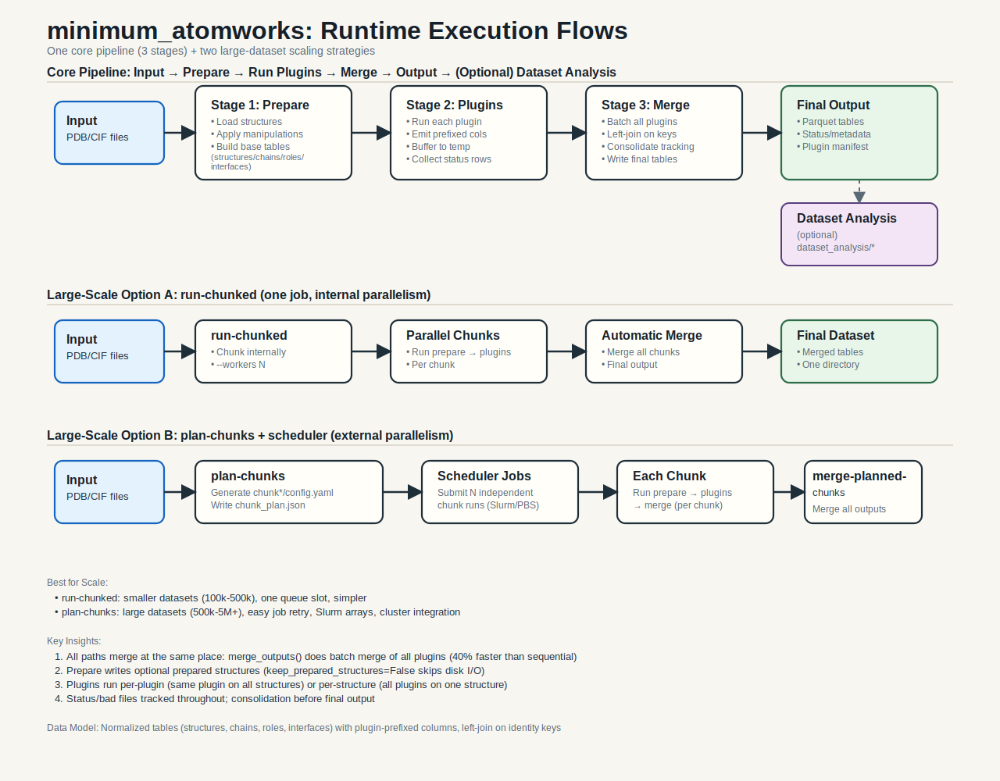
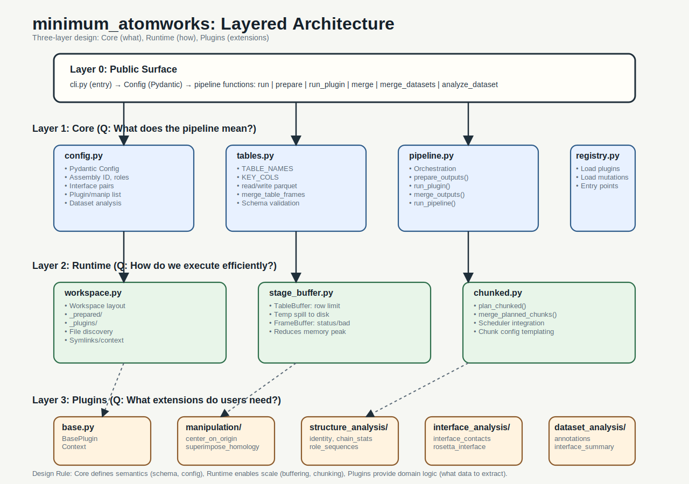

# minimum_atomworks

`minimum_atomworks` is a structural data-processing package for protein complexes.

It produces one unified PDB table:

- `pdb.parquet`

It is designed for:

- antibody-antigen complexes
- VHH or nanobody binders
- generic protein-protein complexes

The package is built around a simple idea:

1. prepare structures once
2. run plugins that add prefixed columns
3. merge into the final PDB table
4. optionally run dataset-level analyses

## 🚀 Large-Scale Processing Optimizations (March 2026)

**New:** Architectural improvements for processing 10k–1M structures efficiently.

- **40% faster merging** of plugin outputs (batch merge strategy)
- **20-30% reduced I/O** with optional structure caching (`keep_prepared_structures`)  
- **Better scalability** for multi-plugin workflows

See [**IMPROVEMENTS_SUMMARY.md**](./IMPROVEMENTS_SUMMARY.md) for quick overview.

For large datasets, see:
- [**LARGE_SCALE_GUIDE.md**](./LARGE_SCALE_GUIDE.md) — Best practices, configs, workflow templates
- [**ARCHITECTURAL_ANALYSIS.md**](./ARCHITECTURAL_ANALYSIS.md) — Technical architecture evaluation
- [**REFACTORING_PROGRESS.md**](./REFACTORING_PROGRESS.md) — Implementation details

## Runtime Overview

Main pipeline:

- `prepare`
  load structures, run quality control, run structure manipulations, run dataset manipulations, cache prepared structures
- `plugins`
  emit prefixed columns into normalized tables
- `merge`
  build the final dataset outputs
- `dataset analyses`
  run aggregate analyses on the merged tables

Large-dataset paths:

- `run-chunked`
  one larger job, internal chunk parallelism via `--workers`
- `plan-chunks` + `merge-planned-chunks`
  generate scheduler-ready chunk configs, run them externally, then merge
- `merge-datasets`
  stack already completed datasets, as long as they are compatible



## Architecture Overview

The package has three internal layers:

- [minimum_atw/core](/home/eva/minimum_atomworks/minimum_atw/core)
  config, row-identity rules, registries, orchestration
- [minimum_atw/runtime](/home/eva/minimum_atomworks/minimum_atw/runtime)
  execution mechanics, chunk planning, workspace layout, spill buffers
- [minimum_atw/plugins](/home/eva/minimum_atomworks/minimum_atw/plugins)
  prepare units, record plugins, dataset analyses

Public entrypoints:

- [minimum_atw/__init__.py](/home/eva/minimum_atomworks/minimum_atw/__init__.py)
- [minimum_atw/cli.py](/home/eva/minimum_atomworks/minimum_atw/cli.py)



## PDB Table

`pdb.parquet` stores all PDB-side outputs together. Row grain is encoded in `grain`:

- `structure`
- `chain`
- `role`
- `interface`

Identity columns:

- `path`
- `assembly_id`
- `grain`
- `chain_id`
- `role`
- `pair`
- `role_left`
- `role_right`

Plugin outputs are merged by identity keys. Non-identity fields are prefixed:

```text
<prefix>__<field>
```

Examples:

- `id__n_atoms_total`
- `iface__n_contact_atom_pairs`
- `abseq__cdr3_sequence`

Internal helper modules such as [interface_metrics.py](/home/eva/minimum_atomworks/minimum_atw/plugins/pdb/calculation/interface_analysis/interface_metrics.py) support plugins but are not themselves YAML-selectable extensions.

## Installation

```bash
git clone <your-repo-url> minimum_atomworks
cd minimum_atomworks
python3.11 -m venv .venv
source .venv/bin/activate
python -m pip install --upgrade pip setuptools wheel
python -m pip install -e .
```

Optional antibody numbering support:

```bash
python -m pip install -e '.[antibody]'
```

Optional AbEpiTope support:

```bash
python -m pip install git+https://github.com/mnielLab/AbEpiTope-1.0
conda install -c bioconda hmmer
```

List extensions:

```bash
python -m minimum_atw.cli list-extensions
```

Notes:

- `abnumber` is optional
- `abepitope` and `hmmsearch` are optional and only needed for the `abepitope_score` plugin
- Rosetta is not installed by this package
- example YAMLs usually need path edits before reuse on another machine

## Common Commands

One-shot run:

```bash
python -m minimum_atw.cli run --config minimum_atw/examples/simple_run/example_antibody_antigen_pdb.yaml
```

Staged run:

```bash
python -m minimum_atw.cli prepare --config minimum_atw/examples/simple_run/example_antibody_antigen_pdb.yaml
python -m minimum_atw.cli run-plugin --config minimum_atw/examples/simple_run/example_antibody_antigen_pdb.yaml --plugin identity
python -m minimum_atw.cli merge --config minimum_atw/examples/simple_run/example_antibody_antigen_pdb.yaml
python -m minimum_atw.cli analyze-dataset --config minimum_atw/examples/simple_run/example_antibody_antigen_pdb.yaml
```

Automatic chunked run:

```bash
python -m minimum_atw.cli run-chunked \
  --config minimum_atw/examples/large_run/example_antibody_antigen_chunked.yaml \
  --chunk-size 100 \
  --workers 4
```

Scheduler-ready chunk planning:

```bash
python -m minimum_atw.cli plan-chunks \
  --config minimum_atw/examples/large_run/example_antibody_antigen_chunked.yaml \
  --chunk-size 100 \
  --plan-dir /path/to/chunk_plan
```

Merge planned chunks:

```bash
python -m minimum_atw.cli merge-planned-chunks --plan-dir /path/to/chunk_plan
```

Merge completed datasets:

```bash
python -m minimum_atw.cli merge-datasets \
  --out-dir /path/to/merged_out \
  --source-out-dir /path/to/out_a \
  --source-out-dir /path/to/out_b
```

## Output Layout

Final outputs in `out_dir/`:

- `pdb.parquet` by default, or your configured `pdb_output_name`
- `run_metadata.json`

Merged dataset outputs also include:

- `dataset_metadata.json`

Dataset analyses write:

- `out_dir/dataset.parquet` by default, or your configured `dataset_output_name`

Optional naming keys in YAML:

- `pdb_output_name: 20250212_pdb.parquet`
- `dataset_output_name: 20250212_dataset.parquet`

Failure/debug output:

- `plugin_status.parquet` is only written for intermediate/checkpointed runs or when any plugin status is non-`ok`
- `bad_files.parquet` is only written when failures occur

Intermediate outputs are only kept when `keep_intermediate_outputs: true`.

## Merge Compatibility

Datasets should only be merged if they represent the same analysis setup.

`merge-datasets` checks:

- recorded runtime compatibility
- final table-column compatibility

So merges are expected to fail if datasets differ in important settings such as:

- active plugins
- manipulations
- interface settings
- antibody numbering settings like `numbering_scheme` or `cdr_definition`
- final normalized-table columns

In short: incompatible CDR or schema setups should fail before merge, not silently combine.

## Examples

Start here:

- [examples/README.md](/home/eva/minimum_atomworks/minimum_atw/examples/README.md)

Detailed guides:

- [simple_run/README.md](/home/eva/minimum_atomworks/minimum_atw/examples/simple_run/README.md)
- [chunk_run/README.md](/home/eva/minimum_atomworks/minimum_atw/examples/chunk_run/README.md)
- [large_run/README.md](/home/eva/minimum_atomworks/minimum_atw/examples/large_run/README.md)

YAML config field meanings:

- [examples/README.md](/home/eva/minimum_atomworks/minimum_atw/examples/README.md)

## Tests

Tests live under:

- [minimum_atw/tests](/home/eva/minimum_atomworks/minimum_atw/tests)

Run them with:

```bash
cd /home/eva/minimum_atomworks
/home/eva/miniconda3/envs/atw_pp/bin/python -m unittest discover -s minimum_atw/tests -v
```

Detailed test instructions:

- [minimum_atw/tests/README.md](/home/eva/minimum_atomworks/minimum_atw/tests/README.md)
